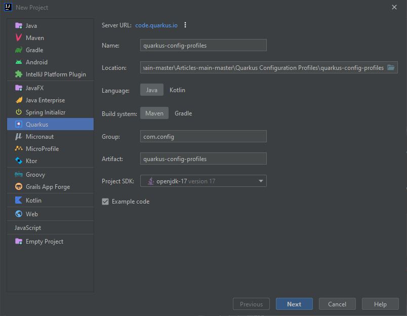
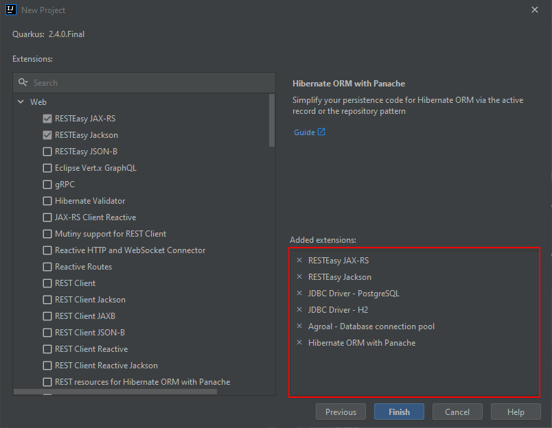
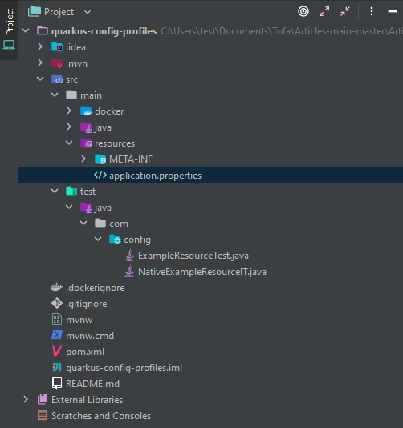

# Quarkus-Configuration-profiles

This repository has the code illustrating how Quarkus Configuration profiles can be used and implemented in both `Yaml` and `.properties` files. Make sure you rename one so that the other can be used.

## Process

